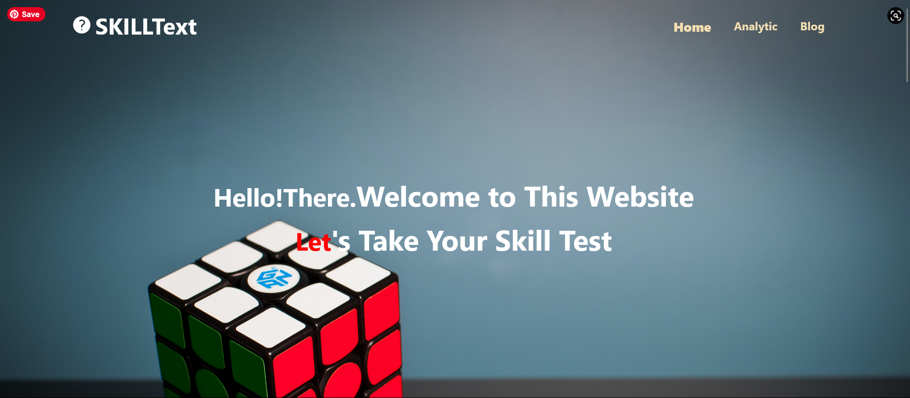

This is a responsive, fully-functional quiz website. I created this whole website using React JS. You can see my live website on: <a href="https://skilltest54.netlify.app/">https://skilltest54.netlify.app/</a> 
-> I have created my website using React JS, Tailwind CSS(DaisyUI) 
-> A wonderful and responsive UI. 
-> Used dynamic and static data 
-> Used netlify to deploy 
-> User can take quizes on this website and can test his skill and also know the correct answers 
